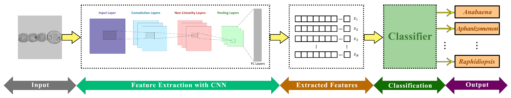

<h3> Authors </h3>
<b>Iman Kianian</b>, MohammadSadeq Mottaqi, Fatemeh Mohammadipanah, Hedieh Sajedi

<h3>Graphical Overview</h3>

<h3> Abstract </h3>
Cyanobacteria are the dominating microorganisms in aquatic environments, posing significant risks to public health due to toxin production in drinking water reservoirs. Traditional water quality assessments for abundance of the toxigenic genera in water samples are both time-consuming and error-prone, highlighting the urgent need for a fast and accurate automated approach. This study addresses this gap by introducing a novel public dataset, TCB-DS (Toxigenic Cyanobacteria Dataset), comprising 2,593 microscopic images of 10 toxigenic cyanobacterial genera and subsequently, an automated system to identify these genera which can be divided into two parts. Initially, a feature extractor Convolutional Neural Network (CNN) model was employed, with MobileNet emerging as the optimal choice after comparing it with various other popular architectures such as MobileNetV2, VGG, etc. Secondly, to perform classification algorithms on the extracted features of the first section, multiple approaches were tested and the experimental results indicate that a Fully Connected Neural Network (FCNN) had the optimal performance with weighted accuracy and f1-score of 94.79% and 94.91%, respectively. The highest macro accuracy and f1-score were 90.17% and 87.64% which were acquired using MobileNetV2 as the feature extractor and FCNN as the classifier. These results demonstrate that the proposed approach can be employed as an automated screening tool for identifying toxigenic Cyanobacteria with practical implications for water quality control replacing the traditional estimation given by the lab operator following microscopic observations. The dataset and code of this paper are publicly available at <a href="https://github.com/iman2693/CTCB">https://github.com/iman2693/CTCB</a>.
