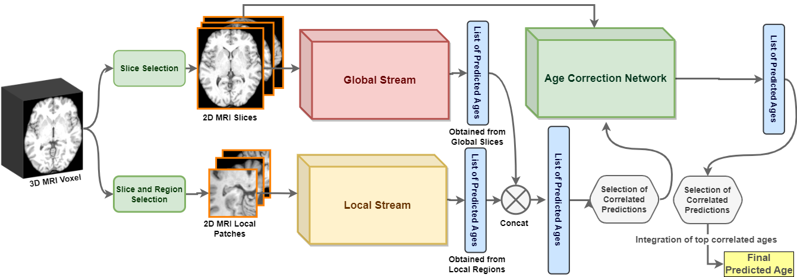

<h3> Authors </h3>
<b>Iman Kianian</b>, Hedieh Sajedi

<h3>Graphical Overview</h3>

<h3> Abstract </h3>

Brain age estimation involves predicting an individual’s biological age from their brain images. This process offers valuable insights into the aging process and the progression of neurodegenerative diseases. Conducting large-scale datasets for medical image analysis is a challenging and time-consuming task. Existing approaches mostly depend on large datasets, which are hard to obtain and expensive. These approaches also require sophisticated, resource-intensive models with a large number of parameters, necessitating a significant amount of processing power. As a result, there is a vital need to develop innovative methods that can achieve robust performance with limited datasets and efficient use of computational resources. This paper proposes a novel slice-based dual-stream method called GDSM (Greedy Dual-Stream Model) for brain age estimation. This method addresses the limitations of large dataset requirements and computational resource intensiveness. The proposed method incorporates local and global aspects of the brain, thereby refining the focus on specific target regions. The approach employs four backbones to predict ages based on local and global features, complemented by a final model for age correction. Our method demonstrates a Mean Absolute Error (MAE) of 3.25 years on the IBID’s test set, which contains only 289 subjects. To demonstrate the robustness of our approach for any small dataset, we analyzed the proposed method with the IXI dataset and achieved an MAE of 4.18 years on the IXI’s test set. By leveraging dual-stream and greedy strategies, this approach achieves efficiency and robust performance, making it comparable with other state-of-the-art methods. The code for the GDSM model is available at <a href="https://github.com/iman2693/GDSM">https://github.com/iman2693/GDSM</a>.
